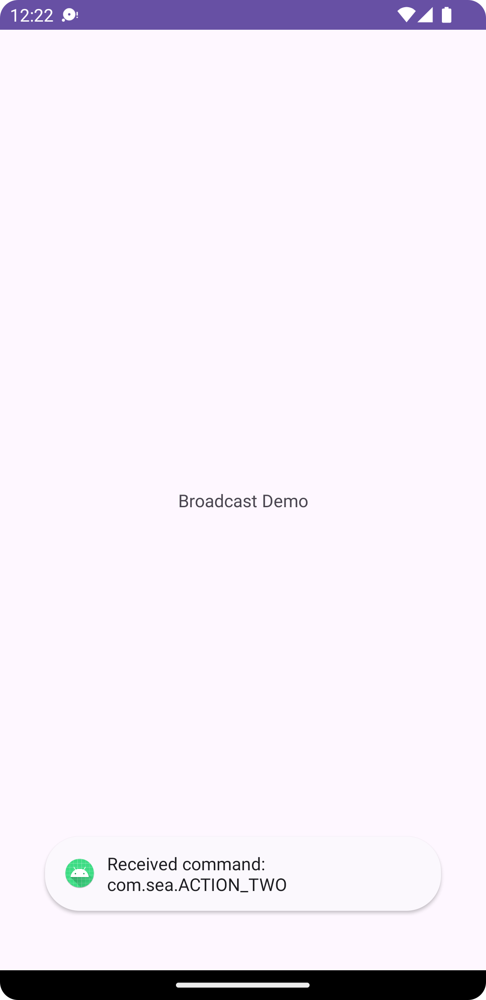

# BroadcastReceiver Demo
This project is a demonstration of an Android app that allows users to interact with the app using `broadcast` via ADB commands. It's designed to showcase how ADB commands can be used to trigger specific actions within the Android app.

## Demo
The demo is run on an Android emulator, and users can send ADB commands to interact with the app.


## Usecase 1: ACTION_ONE

`ADB command`
```
adb -s emulator-5554 shell am broadcast -a com.sea.ACTION_ONE -n com.sea.broadcastreceiver/.MyReceiver
```


`Logcat ouput`
```
2024-01-16 00:23:12.963  2376-2376  MyReceiver              com.sea.broadcastreceiver            D  Received broadcast: com.sea.ACTION_ONE
```


## Usecase 2: ACTION_TWO

`ADB command`
```
 adb -s emulator-5554 shell am broadcast -a com.sea.ACTION_THREE --es key_string go --ei key_integer 100 --ez key_boolean true -n com.sea.broadcastreceiver/.MyReceiver

```


`Logcat ouput`
```
2024-01-16 00:22:32.452  2376-2376  MyReceiver              com.sea.broadcastreceiver            D  Received broadcast: com.sea.ACTION_TWO
2024-01-16 00:22:32.453  2376-2376  handleActi...MyReceiver com.sea.broadcastreceiver            D  Received extra data: two
```

## Usecase 3: ACTION_THREE

`ADB command`
```
 adb -s emulator-5554 shell am broadcast -a com.sea.ACTION_THREE --es key_string go --ei key_integer 100 --ez key_boolean true -n com.sea.broadcastreceiver/.MyReceiver
```


`Logcat ouput`
```
2024-01-16 00:23:54.678  2376-2376  MyReceiver              com.sea.broadcastreceiver            D  Received broadcast: com.sea.ACTION_THREE
2024-01-16 00:23:54.683  2376-2376  handleActi...MyReceiver com.sea.broadcastreceiver            D  Received extras: go, 100, true
```